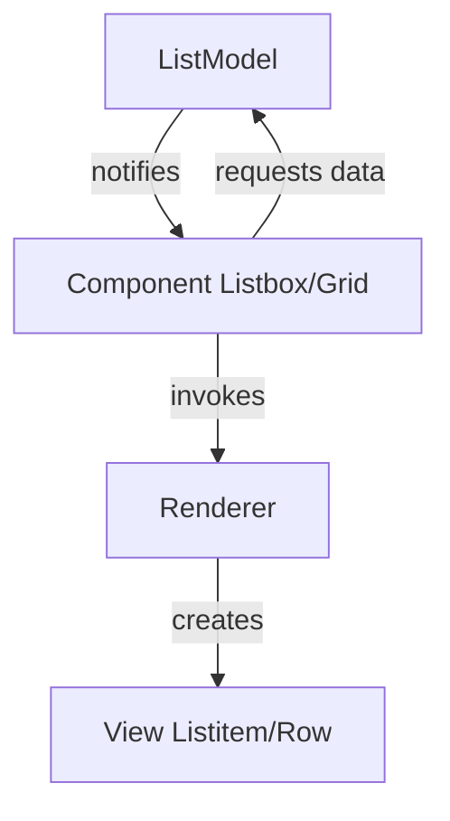

# Controller Guidelines

When generating controller code for ZUL pages, whether using the MVC or MVVM pattern, the code should serve as a working scaffolding or a starting point for application developers.

## General Principles

1. **Provide Realistic Scaffold Code**: The controller should be fully functional to demonstrate the page layout, using mock or example data. It should not contain real application logic but should clearly indicate (e.g., via comments) where developers should insert their actual service/repository calls.
2. **Generate Sample Data**: Generate realistic example data (e.g., sample messages, dashboard metrics, product lists) to populate tables, lists, and summary cards. This prevents the page from looking empty and helps verify the UI binding and layout.
3. **Use Inner Classes for Models**: For simplicity and self-containment in scaffolding, define model objects representing the data (e.g., `Message`, `Product`) as `public static class` within the controller file. Remind developers that these can be refactored into separate files.
4. **Organize Logically**: Group related fields, formatters, initialization, commands/events, and sample data methods together using comment blocks (e.g., `// --- Wired components ---`, `// --- Sample Data ---`).

## MVC Pattern (Extending `SelectorComposer`)

When writing a composer for the MVC pattern:

1. **Class Definition**: Extend `SelectorComposer<Component>`.
2. **Wire Components**: Use the `@Wire` annotation to map ZUL component IDs to Java fields (e.g., `@Wire private Label statusLabel;`).
3. **Initialization**: Override the `doAfterCompose(Component comp)` method. **Always call `super.doAfterCompose(comp);`** first. Inside this method, call helper methods for the initial data loading and UI population.
4. **Event Listening**: Use the `@Listen` annotation for component events (e.g., `@Listen("onClick = #refreshBtn") public void onRefresh()`).
5. **UI Updates**: Write helper methods to manipulate the wired component values directly (e.g., `statusLabel.setValue(...)`, creating `Listitem`s dynamically). Centralize these updates logically (e.g., `loadDashboard()`, `loadStatusCards()`).

## MVVM Pattern (Creating a `ViewModel`)

When writing a ViewModel for the MVVM pattern:

1. **Class Definition**: Create a standard POJO. It does not need to extend any specific ZK class.
2. **State Management**: Define private fields for all UI state (e.g., selected items, search keywords, filtered lists, pagination state) and provide standard getter/setter methods.
3. **Initialization**: Use the `@Init` annotation on a single method to handle setup, such as loading sample data, populating dropdown choices, and applying initial filters.
4. **Commands**: Use the `@Command` annotation on methods triggered by UI interactions (buttons, listbox changes). If a command requires context from the UI, use `@BindingParam("paramName")` in the method signature.
5. **Notification**: Use the `@NotifyChange` annotation on `@Command` methods to explicitly declare which properties have changed and require UI re-rendering (e.g., `@NotifyChange({"filteredList", "totalSize", "activePage"})`).
6. **Data Processing**: Keep filtering, sorting, and paging logic inside the ViewModel acting on the sample data to provide a fully functional example of data manipulation.

## Data Model Usage (Listbox & Grid)

ZK components like `Listbox` and `Grid` use a model-driven rendering approach. Developers should manipulate the data model rather than the UI components directly.

### 1. Model-Driven Rendering



*   **ListModel**: Stores domain objects and notifies the component of data changes.
*   **Component**: Acts as a controller, listening for model changes and handling client events.
*   **Renderer**: Composes the UI for each element in the model.

### 2. Recommended Implementation: `ListModelList`

For most collections, use `org.zkoss.zul.ListModelList`. It implements `java.util.List` and handles UI notifications automatically.

```java
ListModelList<String> model = new ListModelList<>(myDataList);
// CRUD operations update the UI automatically
model.add("New Item");
model.remove(0);
model.set(0, "Updated");
```

### 3. Selection & Sorting

> [!IMPORTANT]
> Do NOT use `listbox.setSelectedIndex()` or `listitem.setSelected()` when a model is assigned. Always use the `ListModel` API.

*   **Selection**: Use `model.getSelection()` and `model.addToSelection(item)`.
*   **Sorting**: Implement `org.zkoss.zul.ext.Sortable` in custom models. `ListModelList` supports sorting via `model.sort(comparator, ascending)`.

### 4. Assignment Methods

| Method | Example (ZUL) |
| :--- | :--- |
| **Composer (MVC)** | `<listbox id="mylist"/>` (wired in Java: `mylist.setModel(model)`) |
| **Data Binding (MVVM)** | `<listbox model="@init(vm.items)"/>` |
| **EL Expression** | `<listbox model="${items}"/>` |
